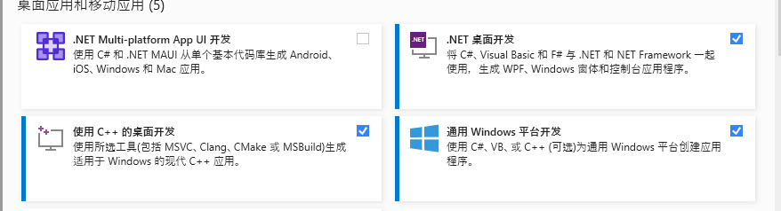

# win11的行情小组件

## 该项目目的

    鉴于win11自带的A股行情有大概五分钟延时， 小组件设置行情没找到在哪就自己写了一个

## 使用方式

### 1、安装visaul studio 2022

    地址：https://visualstudio.microsoft.com/zh-hans/

### 2、安装需要环境

    项目根目录的.vsconfig是我的vs安装配置



### 3、先编译下项目 然后选择QuotationsWidgetProviderPackage右键部署即可

### 4、配置

    在系统的C:\ProgramData\QuotationsWidget路径下新建个config.json文件，
    DataService 类初始化的时候会读这个文件

```csharp
    var list = System.IO.File.ReadAllText("C:\\ProgramData\\QuotationsWidget\\config.json");
```

    在json里设置要显示的行情
	模板如下, code的是市场简称+证券代码 Name就是显示的名字，跟着添加就行， 其他的预留的没啥用

```json
{
  "Market": [
    {
      "Name": "a股",
      "List": [
        {
          "Code": "SZ000001",
          "Name": "平安银行"
        }
      ]
    }
  ],
  "Version": ""
}
```

### 说明 行情是用的雪球的行情 点击中间的空白就自动跳到雪球的在线行情了
